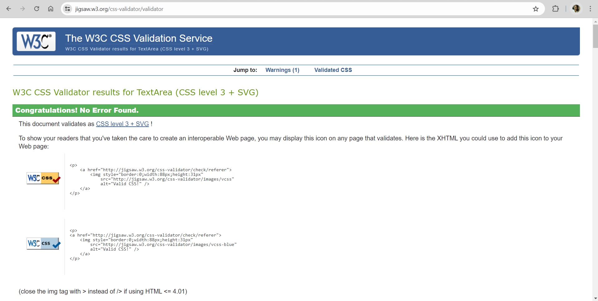

# Sorcerer’s Secret Spells

Sorcerer’s Secret Spells is an online quiz on the magical spells used by witches and wizards for making magical things happen. This is the perfect game for all the Potterheads (Harry Potter fans) out there who believe in the magical world and its charms.   

    

# Table of Contents:

- [Design](#design)
- [Features](#features)

	- [Existing Features](#existing-features) 

        -    [Languages Used](#languages-used)

        -    [Game Rules](#game-rules)

        -    [Begin Quiz](#begin-quiz)  

        -    [Cast Spell](#cast-spell)  

        -   [Footer](#footer)  

   - [Future Features](#future-features)
- [Testing](#testing)   
     -    [Validator Testing](#validator-testing)  
     -    [Bugs](#bugs)

- [Libraries and Programs Used](#libraries-and-programs-used)
- [Credits for Content and Media](#credits)  
- [Deployment](#deployment)

# Design:   

I started with wireframe designs on paper with pencil as shown below:  

    

    

    

**Text & Background colour:**

 I selected both the text and background colours suitable for a magical world for witches and wizards. I wanted to keep the colour palette a bit mysterious and include images related to magic. I have used a lighter shade for the header and the footer to provide some contrast from the main sections.

# Features

# Existing Features:
+ Game Rules
+ Begin Quiz
+ Cast Spell
+ Footer   

# Languages Used:
+ JavaScript
+ HTML5
+ CSS3

# Game Rules 

The quiz has total 20 questions. Each question has 4 options out of which one will be the correct answer. There is a timer of 10 seconds to answer each question before moving onto the next. For each correct answer, you'll get 1 point. At the end, the final score is displayed.
If you score above 17, you are an expert witch or wizard.
If the score is between 7 and 17, you need to practice your spells.
If you score less than 7, you better learn your spells before you need them!
Ready for some magical fun?   

 

# Begin Quiz

This section displays the quiz. The player can see each question and can select his/her answer from the four options given. There is a timer running for each question. At the end of the quiz, the final score is displayed. The player can retake the quiz, if desired.   

  

# Cast Spell

This displays a form where the player can submit a spell along with personal details like name, email address and phone number.   

# Footer  

The footer section has a text indicating that this is copyrighted to Sorcerer’s Secret Spells 2024.   

   

# Future Features:  

+ Include difficulty levels in the game: easy, medium, difficult.
+ Include quiz on more topics like Potions, Quidditch, Hogwarts History, Famous Witches and Wizards etc.

# Testing:  

Testing of the website is done by me, my family, and friends on various devices like mobile phones, tablet, laptop, and desktop. We have verified that the navigation to all the pages, all the links, and the form (including all the input fields) are working as expected.
We have tested the website on both Google Chrome (used for the development) and Microsoft Edge to ensure that the website worked on different browsers.   

# Validator Testing:  

# JSHint:   
JavaScript: No errors were returned when passing through the JSHint validator.    

    

# HTML:  
HTML: No errors were returned when passing through the official W3C validator.    

    

# CSS:   
CSS: No errors were found when passing through the official (Jigsaw) validator.    

    

# Lighthouse (Accessibility Audit):    
Lighthouse score on various categories was checked using Developer Tools.    

     

_Note:_ The performance score of Lighthouse analysis is slightly lower because of the glow effects applied on various elements for a magical effect. As this is a magic related quiz, I felt the glow effect added to its theme and decided to keep it. The website would score a higher value once the glow effect is removed from all components. Other than the performance, everything else is great.    

# Bugs:  

During the development phase, there were a few minor bugs related to the look and feel of the website and JavaScript functionalities like toggling between hide and display of various elements. I was able to fix all the bugs through trial and error using the Development Tools. I also Googled whenever I wanted to implement features such as CSS properties like glowing text, keyframes, flexbox etc. I have given due credit to all the content and media in the credits section of this document.
There are no unfixed bugs existing in this website as per my knowledge.    

# Libraries and Programs Used:  

* Code Repository: [GitHub](https://github.com/)
* Development IDE: [Gitpod](https://www.gitpod.io/)
* [Google Fonts](https://fonts.google.com/)
* [Font Awesome](https://fontawesome.com/)
* Convert .jpg images to .webp: [Convertio](https://convertio.co/webp-converter/)
* Generate favicon: [Favicon](https://favicon.io/favicon-converter/)
* Validating JSON: [JSONLint]( https://jsonlint.com/)

# Credits for Content and Media:
* Images: [Pexels](https://www.pexels.com/)
* Website screenshot across devices: [Am I Responsive?](https://ui.dev/amiresponsive)
* Quiz questions and answers: [Buzzfeed](https://www.buzzfeed.com/kandycehampton/would-you-be-able-to-make-it-to-your-last-year-of-4mhhmw9a14)
* CSS keyframe for animation: [CSS Tricks]( https://css-tricks.com/snippets/css/keyframe-animation-syntax/)
* CSS glowing text: [W3 Schools]( https://www.w3schools.com/howto/howto_css_glowing_text.asp)
* Basic structure of Sorcerer’s Secret Spells is built with the help of this video which shows how to create a quiz with HTML, CSS, and JavaScript. I have used this as a reference while developing my website: [Dear Programmer](https://www.youtube.com/watch?v=WiLTsxjCmWQ)   
* Love Maths project
* My Mentor Martina for her guidance and the Slack Community for their support.

# Deployment:

The website is deployed to GitHub pages. The steps to deploy are as follows:

In the GitHub repository, navigate to the Settings tab.
From the Settings tab, select the 'Pages' tab in the 'Code and Automation' section.
From the source section drop-down menu, select the 'Main' branch.
Also, check the folder selected is set to / (root) and click Save.
Return to the 'Code' tab of GitHub repo and wait a few minutes for the build to finish.
Refresh the page. Click on github-pages to view the Deployments History. Click View deployment to open the live URL.

_Note:_ The live website link: https://arathivariar.github.io/sorcerers_secret_spells/

